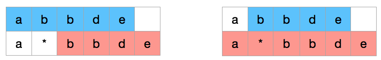

[10. 正则表达式匹配](https://leetcode-cn.com/problems/regular-expression-matching/)

看了答案，记录一下。

### 铺垫

两个字符串，直接相比较是否匹配，它的结果等于：第一个字符是否匹配 and 剩下的字符是否匹配。

所以这是一个动态规划过程：dp[i] = dp[0] and dp[i-1]

dp[] 里装的是 True or False。如果 dp[i] 表示直到第 i 个字符是否匹配。

用递归表描述这种解法：

最后如果 s 和 p 同时为空表示匹配，返回True。否则返回 False。

```py
class Solution:
    def isMatch(self, s: str, p: str) -> bool:
        if p and s:
            return s[0] == p[0] and self.isMatch(s[1:], p[1:])
        else:
            return False if p or s else True
```

当然也可以自底向上的用迭代解法：

```
class Solution:
    def isMatch(self, s: str, p: str) -> bool:
        dp = [ False ] * max(len(s), len(p))
        for i in range(min(len(s), len(p))):
            dp[i] = s[i] == p[i]
            if not dp[i]:
                return False
        return dp[-1]
```

可以优化一下 dp 内存，每次只需要记录当前值即可，这就变成了普通的迭代。

### 判断 '.' 

`.` 只表示一个任意字符。

```py
class Solution:
    def isMatch(self, s: str, p: str) -> bool:
        if p and s:
            return p[0] in {s[0], '.'} and self.isMatch(s[1:], p[1:])
        else:
            return False if p or s else True
```

### 考虑 '*' 的情况

'*' 只有在第二或之后的位置有效。

对于 'abbde' 和 'a*bbde' 有两种情况要考虑：

1. 假设 `a*` 匹配 0 个字符，那么需要把 'abbde' 和 'bbde' 比较
2. `a*` 匹配掉了第一个 `a`，那么接下来仍需要 'bbde' 和 'a*bbde' 比较。因为下次 `a*` 还可以匹配 0 个字符。



```py
class Solution:
    def isMatch(self, s: str, p: str) -> bool:
        if not p:
            return not s
        first_match = bool(s) and p[0] in {s[0], '.'}
        if len(p) >= 2 and p[1] == '*':
            return self.isMatch(s, p[2:]) or first_match and self.isMatch(s[1:], p)
        else:
            return first_match and self.isMatch(s[1:], p[1:])
```

### 备忘录

备忘录是动态规划里「自顶向下」的解法，目的是记录之前的计算结果，避免重复计算。

上边的解法里 `self.isMatch(s, p[2:])` 和 `self.isMatch(s[1:], p)` 可能会有重复的计算。

令 dp[i,j] = self.isMatch(s[i:], p[j])

```py

class Solution:
    def isMatch(self, s: str, p: str) -> bool:
        memo = {}

        def dp(i, j):
            if (i, j) not in memo:
                if j == len(p):
                    ans = i == len(s)
                else:
                    first_match = i < len(s) and p[j] in {s[i], '.'}
                    if j+1 < len(p) and p[j+1] == '*':
                        ans = dp(i, j+2) or first_match and dp(i+1, j)
                    else:
                        ans = first_match and dp(i+1, j+1)
                memo[i, j] = ans
            return memo[i, j]
        
        return dp(0, 0)

test_case = {
    ("ab", ".*c") : False,
    ("aa", "a*") : True,
    ("ab", ".*") : True,
    ("aab", "c*a*b") : True,
    ("mississippi", "mis*is*p*.") : False,
}
solution = Solution()

for args, res in test_case.items():
    s, p = args
    r = solution.isMatch(s, p)
    if r != res:
        print(f'Fail,', args, res, r)
        break
    else:
        print(f'SUCCESS, {args}')
```

